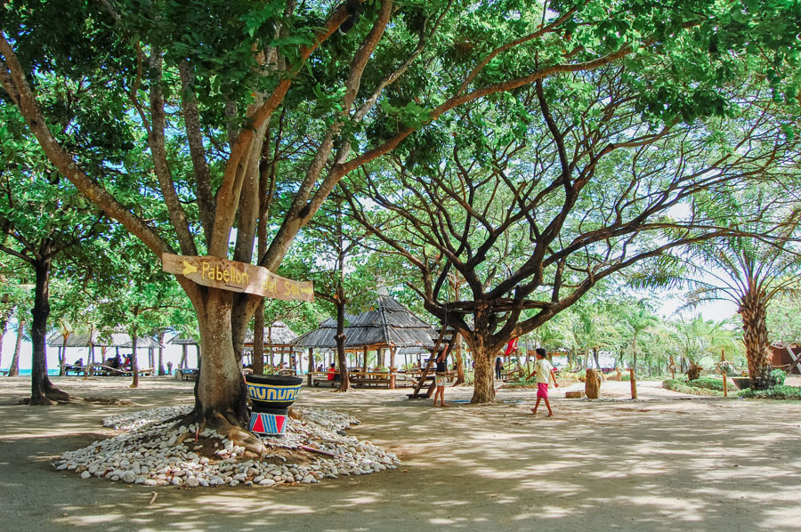

# Oasis in Tigbauan, Iloilo

Nestled in the heart of Tigbauan, Iloilo, **Oasis** is a tranquil retreat that offers a refreshing escape from the hustle and bustle of city life. Our resort blends lush tropical landscapes, serene swimming pools, and cozy accommodations to create the perfect haven for relaxation, rejuvenation, and reconnection with nature.

## Why Oasis Stands Out

- **Idyllic Location**  
  Located in Brgy. Barosong, just a scenic drive from Iloilo City, Oasis combines accessibility with peaceful seclusion—ideal for travelers seeking both comfort and escape. :contentReference[oaicite:1]{index=1}

- **Resort-Style Comforts**  
  Whether it’s lounging poolside at sunset or stargazing under the open sky, Oasis offers unmatched ambience and amenities—designed to soothe and delight. :contentReference[oaicite:2]{index=2}

- **Unique Glamping Experiences**  
  For a blend of rustic charm and modern comfort, the pet-friendly glamping setup at Casa Amistad offers a cozy and outdoorsy experience tailored for both tourists and travelers. :contentReference[oaicite:3]{index=3}

- **Immersed in Nature’s Beauty**  
  Surrounded by rolling landscapes and tranquil scenery, Oasis provides a rejuvenating retreat for anyone looking to unwind and recharge—whether alone or with loved ones.

- **Warm Local Hospitality**  
  With personalized services and attention to even the smallest details, guests feel genuinely cared for, making every stay memorable.

## Why Oasis Is a Better Choice Than Janiuay

- **Exclusive Resort Ambience vs. Local Charm**  
  While Janiuay offers authentic small-town experiences and historic appeal, Oasis specializes in dedicated resort relaxation—making it the go-to for stress-free tranquility. :contentReference[oaicite:4]{index=4}

- **Amenities Tailored for Leisure**  
  Oasis has facilities shaped specifically for comfort—resort pools, glamping setups, and soothing environments—whereas Janiuay focuses more on rural tourism and exploration.

- **Perfect for Unwinding**  
  Looking to kick back by the pool or cozy up around a bonfire? Oasis delivers on that front. If you're after peaceful downtime, it's simply made for that.

---

###  Suggested Usage Examples

| Usage Context         | Sample Description Snippet                                      |
|-----------------------|------------------------------------------------------------------|
| **Airbnb Listing**     | "Escape to Oasis in Tigbauan—lush nature, glamping comfort, and warm hospitality just a short drive from Iloilo City." |
| **Social Media Promo** | "Discover your tranquil haven at Oasis in Tigbauan—where every sunset poolside feels like paradise." |
| **Travel Blog**        | "Oasis in Tigbauan offers a rare mix of resort-style relaxation and rustic elegance, making it an excellent alternative to immersive—but more rural—Janiuay." |

---

### TL;DR

**Oasis in Tigbauan** shines as a retreat destination—offering serene surroundings, resort-level amenities, and cozy glamping comforts—ideal for those who want to relax in style. **Janiuay**, on the other hand, is best for those seeking cultural immersion and rustic exploration. Choose Oasis for your perfect honeymoon of comfort—or Janiuay if you crave authentic provincial charm.

Need help tweaking this further for GitHub README, Airbnb, or social media content? Just say the word!
::contentReference[oaicite:5]{index=5}
